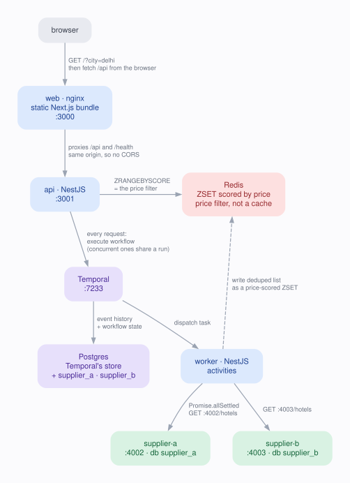

<h1 align="center">Hotel Offer Orchestrator</h1>

<p align="center">
  Aggregates overlapping hotel offers from two independent supplier services, keeps the
  cheapest price per hotel, and filters by price range inside Redis —<br>
  orchestrated by a <b>Temporal</b> workflow, deployed on <b>AWS</b>.
</p>

<p align="center">
  
  
  
  
  
  
</p>

---

## Live demo

| | Link |
| :-- | :-- |
| **Web app** | **https://d25tqeh2vfoq4q.cloudfront.net** |
| **Temporal UI** (real workflow histories) | **http://ec2-3-108-208-55.ap-south-1.compute.amazonaws.com:8080** |
| API — hotels in Delhi | https://d25tqeh2vfoq4q.cloudfront.net/api/hotels?city=delhi |
| API — price filtered | https://d25tqeh2vfoq4q.cloudfront.net/api/hotels?city=delhi&minPrice=4000&maxPrice=6000 |
| Health of every dependency | https://d25tqeh2vfoq4q.cloudfront.net/health |

**Try the interesting part:** open the web app and press **Take down** next to Supplier A.
The health panel turns `degraded`, an amber banner appears, prices shift to Supplier B's,
and one hotel disappears — because only Supplier A sold it. Press **Bring up** to restore.
Then open the Temporal UI to see the workflow run that produced it, including the retries
against the supplier you just switched off.

> The web app is on HTTPS via CloudFront. The Temporal UI is a direct EC2 port on plain
> HTTP, so your browser will flag it as "Not secure" — it is a demo box holding no real data.

## Screenshots

<!-- SCREENSHOTS: drop files into docs/screenshots/ and uncomment the matching line.
     Suggested set:
       01-home.png          the app with results for delhi
       02-degraded.png      one supplier taken down, amber banner visible
       03-temporal.png      a workflow history in the Temporal UI
       04-health.png        the /health JSON
-->
<!-- <p align="center"></p> -->
<!-- <p align="center"></p> -->
<!-- <p align="center"></p> -->

_Screenshots are being added._

## What it does

Two suppliers sell overlapping hotels at different prices and commissions. This service
asks both of them at once, keeps the cheapest offer for each hotel name, and serves the
result — staying useful even when a supplier is down.

The problem it is really solving is **partial failure**: an aggregator that returns
nothing because one upstream is unavailable is worse than one that returns what it has
and says so.

## Architecture

<p align="center">
  
</p>

<!-- Rendered from docs/architecture.dot with Graphviz; see that file's header to regenerate. -->

- **`api`** serves the public endpoint.
- **`worker`** runs the workflow and its activities. Same image as `api`, different
  entrypoint, scaled independently.
- **`supplier-a` / `supplier-b`** stand in for third parties we do not own: separate
  processes on ports `4002` and `4003`, each owning its own database (`supplier_a`,
  `supplier_b`) and reachable only over HTTP. Source in `suppliers/`, one small
  `node:http` service run twice with a different identity.
- **Postgres** holds Temporal's persistence store and the two supplier databases.
  The orchestrator itself keeps no relational state: it has no connection to those
  tables and can only ask the suppliers over the wire.
- **Redis** holds the deduplicated list as a sorted set scored by price, so the
  price filter is a single `ZRANGEBYSCORE` executed by Redis, not in application code.
  It is a **price-filtering store, not a cache**: every request runs the workflow and
  writes a fresh set, so a quoted price is never older than the request that asked for it.

### Request flow

1. `GET /api/hotels?city=delhi` runs the `aggregateHotelOffers` workflow. Every
   request does — there is no cache in front of it. Concurrent requests for the same
   city do share one run (`workflowIdConflictPolicy: USE_EXISTING`), so a burst costs
   one orchestration rather than one each.
2. The workflow calls both suppliers **in parallel** (`Promise.allSettled` over two
   activities, each retried up to 3 times by Temporal), selects the cheapest offer
   per hotel name, and writes the result to Redis as a price-scored sorted set. One
   supplier failing degrades the result instead of failing it — see
   [Failure handling](#failure-handling).
3. The API reads the list back with a single `ZRANGEBYSCORE`, so `minPrice`/`maxPrice`
   are applied by Redis rather than by application code.
4. `X-Degraded-Suppliers` names any supplier that could not be reached.

One search in the UI is therefore one workflow in the Temporal UI — that is the point
of running Temporal at all, and it is visible rather than hidden behind a cache.

## Project layout

```
.
├── frontend/     Next.js 16 static export — client-rendered, no Node server in prod
├── backend/      NestJS API + the Temporal worker (one image, two entrypoints)
├── suppliers/    The two stand-in supplier services: one node:http app, run twice
├── infra/        docker-compose (local + prod), Dockerfiles, Terraform, deploy scripts
├── postman/      One collection, 26 requests, targets local or EC2 via one variable
└── docs/         Architecture diagram source and screenshots
```

Each supplier is a separate process with **its own Postgres database** (`supplier_a`,
`supplier_b`) and is reachable only over HTTP. The orchestrator holds no credentials
for those tables — it has to ask, exactly as it would a real third party.

## Deployment

The whole stack runs on one **t3.micro** EC2 instance plus CloudFront and S3. Terraform
creates the instance, its IAM role, security group and Elastic IP; the deploy scripts
push images and ship the compose file.

```
Browser ──► CloudFront ──┬──► S3            static Next.js bundle
                         └──► EC2 :4001     /api/*, /health  (origin restricted
                                             to CloudFront's edge IP ranges)

EC2 (docker compose)
  api · worker · supplier-a · supplier-b · postgres · redis · temporal · temporal-ui
```

Same origin for the UI and the API, which removes CORS entirely and means one free
certificate — the default `*.cloudfront.net` one, so HTTPS costs nothing and needs no
domain.

```bash
cd infra
cp .env.aws.example .env.aws     # AWS credentials; gitignored
terraform -chdir=terraform init
terraform -chdir=terraform apply

./scripts/deploy-backend.sh      # builds both images for amd64, pushes to ECR,
                                 # ships docker-compose.prod.yml, restarts the stack
./scripts/deploy-frontend.sh     # builds the static bundle, syncs to S3, invalidates
```

Notable choices:

- **No SSH.** The instance has no key pair and no port 22 rule. Shell access is AWS SSM
  Session Manager, so access is IAM-controlled and logged in CloudTrail:
  `aws ssm start-session --target <instance-id> --region ap-south-1`
- **Images are never built on the box.** 1 GiB of RAM cannot spare it, so
  `docker buildx --platform linux/amd64` cross-builds locally and pushes to ECR. Two
  tags in one repository (`:latest`, `:suppliers`) rather than two repositories.
- **The compose file is shipped every deploy**, base64'd over SSM, with a `.bak` kept.
  The instance cannot drift from what is committed here.
- **The database password is generated on the box** on first deploy and never leaves it.
- **A 2 GiB swapfile** is provisioned by `user_data`; 1 GiB is tight while the Temporal
  worker bundles its workflow code at startup.

## Run it

Docker is the only prerequisite.

```bash
cd infra
cp .env.example .env      # no third-party keys needed
docker compose up -d --build
```

| Service      | URL                                            |
| ------------ | ---------------------------------------------- |
| Web UI       | http://localhost:3000                          |
| API          | http://localhost:3001/api/hotels?city=delhi    |
| Health       | http://localhost:3001/health                   |
| Temporal UI  | http://localhost:8080                          |

The web UI drives every scenario: a health panel with per-dependency latency, a
**Take down / Bring up** button per supplier, quick links for the overlapping-city,
price-filtered and no-results cases, and a banner when results are partial.

```bash
docker compose logs -f worker   # watch the workflow run
docker compose down -v          # tear down, including volumes
```

## Endpoints

| Method | Path                                        | Notes                                              |
| ------ | ------------------------------------------- | -------------------------------------------------- |
| GET    | `/api/hotels?city=&minPrice=&maxPrice=`     | Deduplicated, cheapest-per-hotel                   |
| GET    | `/health`                                   | Redis, Temporal **and both suppliers**             |
| GET    | `/health/live`                              | Liveness only, no dependencies                     |
| GET    | `/api/suppliers`                            | Current availability of each supplier              |
| PUT    | `/api/suppliers/:id/availability`           | Fault injection: `{ "available": false }`          |

Response header on `/api/hotels`: `X-Degraded-Suppliers`, listing any supplier that
could not be reached. The body stays the plain array the spec pins down.

`city` is required. `minPrice`/`maxPrice` are optional, inclusive, non-negative
integers. Unknown query parameters are rejected with `400`. Cities are matched
case-insensitively; `delhi`, `mumbai` and `bangalore` have data.

The supplier services are separate, on their own ports:

| Method | Path                        | Service                                   |
| ------ | --------------------------- | ----------------------------------------- |
| GET    | `:4002/hotels?city=`        | Supplier A, straight from `supplier_a`    |
| GET    | `:4003/hotels?city=`        | Supplier B, straight from `supplier_b`    |
| GET    | `:400x/health`              | The supplier's own database check         |
| GET/PUT| `:400x/admin/availability`  | Its kill switch, proxied by `/api/suppliers` |

```bash
curl 'http://localhost:3001/api/hotels?city=delhi&minPrice=4000&maxPrice=6000'
```

```json
[
  { "name": "Holtin",  "price": 5340, "supplier": "Supplier B", "commissionPct": 20 },
  { "name": "Radison", "price": 5900, "supplier": "Supplier A", "commissionPct": 13 }
]
```

## Health

`/health` probes every dependency in parallel and reports each one with latency:

```json
{
  "status": "degraded",
  "checkedAt": "2026-09-20T01:59:25.000Z",
  "redis":    { "status": "up", "latencyMs": 1 },
  "temporal": { "status": "up", "latencyMs": 2 },
  "suppliers": {
    "supplierA": { "status": "down", "latencyMs": 3, "error": "responded 503" },
    "supplierB": { "status": "up",   "latencyMs": 157 }
  }
}
```

| `status`    | Meaning                                       | HTTP |
| ----------- | --------------------------------------------- | ---- |
| `ok`        | Everything answered                           | 200  |
| `degraded`  | One supplier is out; requests still served    | 200  |
| `unhealthy` | Redis or Temporal down, or *both* suppliers   | 503  |

Suppliers are probed over HTTP exactly the way the activity reaches them, so the
report cannot drift from reality. The container healthcheck uses `/health/live`
instead: an upstream outage must never make the container look dead and get
restarted or drained.

## Failure handling

Each layer handles the failures it owns, and nothing swallows a failure silently.

| Failure                        | Handled by                                                      |
| ------------------------------ | --------------------------------------------------------------- |
| Supplier 5xx / timeout         | Activity throws a **retryable** failure; Temporal retries 3×     |
| Supplier 4xx                   | **Non-retryable** — a retry cannot fix a bad request             |
| One supplier down after retries| Workflow degrades: `allSettled`, use the survivor, log a warning |
| Both suppliers down            | Workflow fails non-retryably → API answers **503**, never a 500  |
| Redis write fails              | Retryable activity failure, so a blip does not kill the workflow |
| Bad query string               | Rejected at the edge with **400** before any work is done        |

Activities log the supplier, city, **attempt number** and latency on every call, so a
retry storm is visible in `docker compose logs worker`. Workflow-level logging uses
Temporal's replay-safe `log`, and the failure reason is unwrapped out of Temporal's
`ActivityFailure` so logs carry `Supplier A responded 503`, not `Activity task failed`.

## Simulating a supplier outage

Each supplier owns its own kill switch; the orchestrator's admin endpoint forwards
to it over HTTP, so the outage happens at the supplier rather than in our state:

```bash
curl -X PUT localhost:3001/api/suppliers/supplierA/availability \
     -H 'content-type: application/json' -d '{"available":false}'
```

Supplier A now answers `503`, `/health` turns `degraded`, and `/api/hotels` keeps
working from Supplier B with `X-Degraded-Suppliers: Supplier A`. The effect is visible
on the next request, because there is nothing cached to wait out. The same switch is
wired to the **Take down / Bring up** buttons in the UI.

The endpoint is unauthenticated, so it is gated behind `ENABLE_FAULT_INJECTION`
(default `true` here, set `false` for a real deployment).

## Postman

`postman/Hotel-Offer-Orchestrator.postman_collection.json` — 26 requests and 58
assertions, in four ordered folders: health, the supplier services (their catalogues,
their own database health, and the availability flag they own), hotels (overlapping
city, price filter, inclusive bounds, no results, validation), and the supplier-outage
sequence. Run the whole collection in order; the last folder restores both suppliers.

One collection file, one variable. `target` defaults to `ec2`, so importing and
hitting Send works against the deployed stack with no setup; set it to `local` for the
Docker stack. `baseUrl`, `supplierAUrl` and `supplierBUrl` are derived from it by a
collection pre-request script, so there is nothing to keep in step:

```bash
newman run postman/Hotel-Offer-Orchestrator.postman_collection.json                      # ec2
newman run postman/Hotel-Offer-Orchestrator.postman_collection.json --env-var target=local
```

Because the default is the deployed stack, the outage folder switches **real** suppliers
off and on. It restores both at the end, but a run cancelled midway can leave one down —
`PUT {{baseUrl}}/api/suppliers/:id/availability` with `{"available":true}` puts it back.

The `ec2` target hits the instance directly on 4001/4002/4003 rather than CloudFront,
because the suppliers are not routed through CloudFront at all. Those ports are
restricted by `var.test_access_cidr`
in the Terraform, which defaults to a single address — update it when yours changes.
`ec2Host` comes from `terraform output api_origin`.

## Tests

```bash
cd backend   && npm test          # 51 unit + module-wiring tests, no infra needed
cd frontend  && npm test          # 13 tests
cd suppliers && npm test          # 4 tests against a real Postgres; skips if none is up
cd backend   && npm run test:e2e  # 14 tests; needs the stack up, drives the real workflow
```

`backend/src/app.module.spec.ts` boots the entire Nest graph with Redis and Temporal
stubbed, so a missing module import fails in under a second instead of at deploy time.
`backend/test/hotels.e2e-spec.ts` is the only check that proves suppliers, Temporal and
Redis are genuinely wired together; it takes suppliers down for real and restores them
afterwards. `test/fake-redis.ts` is a small in-memory double with real score-ordering
and SCAN semantics, so the cache logic is covered without Docker. `suppliers/server.test.js`
runs against a real Postgres — the catalogue lives in one, so faking it would prove
nothing; it skips rather than fails when no database is reachable.

## Local development without Docker

Redis, Temporal and Postgres still need to be running
(`docker compose up -d redis temporal postgres`); all three publish their ports
for exactly this. Every default in `backend/src/config/env.ts` points at
`localhost`.

The frontend is a static client-side bundle, so in production it shares an origin
with the API and needs no base URL. Running `next dev` on `:3000` against the API
on `:3001` is the one case where it does:

```bash
echo 'NEXT_PUBLIC_API_BASE_URL=http://localhost:3001' > frontend/.env.local
```

```bash
cd suppliers
npm run start:a            # Supplier A on :4002, database supplier_a
npm run start:b            # Supplier B on :4003, database supplier_b

cd backend
npm run start:dev          # API on :3001
npm run start:worker:dev   # worker, separate terminal

cd frontend && npm run dev # :3000, reads NEXT_PUBLIC_API_BASE_URL from .env.local
```

Each supplier creates and seeds its own database on first boot, so there is no
migration or seed step to remember.

## Deliberately left out

- **Auth** — out of scope by request.
- **An ORM and a migration tool for the supplier databases.** Each supplier owns one
  table and creates it on boot with `CREATE TABLE IF NOT EXISTS`. Add migrations when
  the schema starts changing under live data.
- **A relational model inside the orchestrator.** Nothing it computes outlives the
  Redis TTL, and the supplier tables belong to the suppliers: it reaches them over
  HTTP and holds no database credentials of its own.
- **Workflow replay tests** (`@temporalio/testing`). The workflow's branching lives in
  `partitionFeeds` and `selectBestOffers`, both pure and unit tested, and the e2e suite
  runs the real thing. Add them when the workflow grows timers or signals.
- **Structured JSON logging, metrics, tracing, rate limiting.** One env-driven logger
  swap and a `ThrottlerModule` when this goes anywhere near the public internet.
- **`temporalio/auto-setup`** is a development image: it provisions the schema on boot.
  Point `TEMPORAL_ADDRESS` at a managed cluster for a real deployment.
